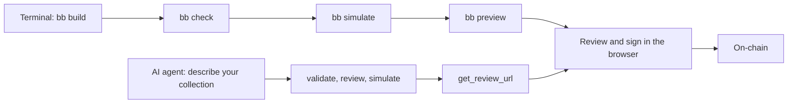

# Your First Collection

This page goes from an idea to a signed collection on-chain. The output examples show the response shapes to expect. Hashes, preview codes, gas usage, timestamps, and review counts are illustrative; use the values returned by your own commands.

Start by describing what you want to your AI. The BitBadges builder turns that request into a transaction you can review and sign. For repeatable scripts, the CLI walkthrough follows below.

Both walkthroughs use browser signing: the builder prepares the transaction, and you sign with your own wallet.



## Path A: create with your AI

### 1. Connect the builder

Follow [Set Up Your AI](../agents/setup.md) to connect the BitBadges MCP builder to Claude Code, Claude Desktop, Cursor, Codex, or another MCP client. That page covers installation and the API key used for queries, simulation, and review links. Use the browser-signing setup; your wallet keeps the signing key.

### 2. Describe what you want

```text
Hey Claude, create me a 5 ATOM / month subscription.
```

That is enough to start. The agent can load the subscription skill and assemble the collection, payment approval, and expiring balances for you. Give it your wallet address, the address that receives payments, and the collection name when it asks. You can use the same address for creator, manager, and payment recipient.

For a more specific starting point:

```text
Create a subscription called Pro Plan that costs 5 ATOM per 30-day period.
Ask me for my creator, manager, and payment recipient addresses.
Make membership non-transferable and lock the price.
Validate, review, and simulate the transaction, explain any findings,
then give me a link to review and sign with my wallet.
```

The monthly preset means **30 days**, not a calendar month. The builder resolves ATOM to its supported denomination on BitBadges. Creating the collection sets up paid access; subscribers pay when they subscribe. Automatic renewal requires a subscriber's renewal authorization and a subsequent renewal transaction. See [Subscriptions](../use-cases/subscriptions.md).

You can keep refining the design in the conversation: change the payment coin, add tiers, or allow memberships to be transferred. Ask for a fresh validation, review, and simulation after changes. The same flow works for NFTs, fungible tokens, payment requests, and smart tokens; browse [builder skills](../agents/skills/README.md) for more starting points.

### 3. Review and sign

The agent uses `validate_transaction`, `review_collection`, and `simulate_transaction`, resolves errors, and calls `get_review_url`. Open the returned link to inspect the collection, payment recipient, price, ownership duration, transferability, and permissions. Sign with your wallet when the result matches your intent. The signing account needs BADGE for transaction fees.

The link is a prepared transaction, not a deployed collection. After signing, confirm the transaction and its new collection ID on BitBadges. For a CLI confirmation, see [step 5 below](#5-confirm).

Building another collection in the same conversation? Ask the agent to start with `reset_session` so the previous collection's approvals do not carry over.

## Path B: the CLI

Use this path to build the same 5 ATOM subscription from flags or repeat the build in a script.

### Prerequisites

```bash
curl -fsSL https://install.bitbadges.io | sh
bb settings set apiKey "${BITBADGES_API_KEY:?Set your developer portal API key}"
bb doctor
```

Get a key at [bitbadges.io/developer](https://bitbadges.io/developer). You do not need one to build; you need one for simulation and queries. Fund the signing account with BADGE for transaction fees. See [Quickstart](quickstart.md#networks) for network and fee details.

### 1. Build

```bash
bb build subscription \
  --interval monthly --price 5 --denom ATOM \
  --recipient bb1w63npeee74ewuudzf8cgvy6at4jn4mjr0a9r5p \
  --creator bb1w63npeee74ewuudzf8cgvy6at4jn4mjr0a9r5p \
  --manager bb1w63npeee74ewuudzf8cgvy6at4jn4mjr0a9r5p \
  --name "Pro Plan" --description "Monthly access." --image https://example.com/pro.png \
  --output-file tx.json
```

Replace all three example addresses before building: `--creator` is the wallet that signs, `--manager` is the address that manages the collection, and `--recipient` receives subscription payments. You can use your wallet address for all three. Leave them out and the message ships with `creator: ""`, which the chain rejects at simulate time, not build time.

The build prints a review to stderr, then writes the file:

```text
━━━ Review ━━━━━━━━━━━━━━━━━━━━━━━━━━━━━━━━━━━━━━━━━━━━━━━━━━━━━━━━━━━━━━━━━━━━━━
  Summary  0 critical  ·  2 warning  ·  3 info  ·  verdict: warn
━━━━━━━━━━━━━━━━━━━━━━━━━━━━━━━━━━━━━━━━━━━━━━━━━━━━━━━━━━━━━━━━━━━━━━━━━━━━━━━━
Written to tx.json
```

Zero critical findings. The warning and info entries are advisory; step 2 shows how to read them.

The file holds the universal envelope. `data` is the message; `hint` is the next command:

```json
{
  "ok": true,
  "data": { "typeUrl": "/tokenization.MsgCreateCollection", "value": { "creator": "bb1w63np…", "…": "…" } },
  "warnings": [],
  "hint": "Next: bb check tx.json && bb preview tx.json --open — audits it, then opens the browser to review and sign.",
  "meta": { "review": { "summary": { "critical": 0, "warning": 2, "info": 3, "verdict": "warn" } } },
  "error": null
}
```

### 2. Check

```bash
bb check tx.json
```

```json
{
  "ok": true,
  "data": { "review": { "summary": { "critical": 0, "warning": 2, "info": 3, "verdict": "warn" }, "findings": ["…"] } },
  "warnings": [],
  "error": null
}
```

Exit code 0. A `warn` verdict means the reviewer found no critical issue; it does not guarantee a safe or successful transaction. Read the warning anyway; it tells you a permission is neutral, which is a choice the manager still holds.

The builder locks the mint (faucet) approval forever by default. Nobody, including the manager, can re-point it after launch, so its mint rules cannot be changed through an approval update. This does not cap how many subscriptions users can buy. Every other approval stays editable.

**Need to change the price later?** The price lives in that faucet approval, so locking it freezes the price too. Build with the opt-out:

```bash
bb build subscription … --updatable-mint --output-file tx.json && bb check tx.json
```

```json
{
  "ok": false,
  "data": null,
  "hint": "Fix the reported errors and critical findings (each carries a recommendation), then re-run `bb check`. Do not preview or deploy a transaction that fails here.",
  "error": { "code": "review_critical", "message": "Check failed: 1 critical review finding(s)." }
}
```

Exit code 2, and the one critical finding is the one you chose:

| Finding | What it means | Recommendation |
| --- | --- | --- |
| Mint approvals can be modified (unlimited supply risk) | The manager can edit the faucet later, including its price, and could also re-point it to mint for free. | Lock canUpdateCollectionApprovals for mint-related approvals (fromListId: "Mint"). Use scoped approval permissions to lock mint while allowing transfer approval updates if needed. |

That is not a bug. The reviewer does not know your intent, so it flags anything a manager could abuse and leaves the decision to you. `bb check` fails so the choice is visible to whoever signs. If you mean it, preview and sign anyway; the site shows the same finding.

`bb explain tx.json` prints the transaction in plain English if the review text is too dense.

### 3. Simulate

```bash
bb simulate tx.json
```

```json
{
  "ok": true,
  "data": { "success": true, "valid": true, "gasUsed": "118061", "events": ["…"], "netChanges": {} },
  "warnings": [],
  "error": null
}
```

`valid: true` means simulation succeeded against the state checked. Balances, approvals, fees, and account sequence can change before broadcast; simulation is not a guarantee of inclusion or success. A failing simulation exits 2 with `ok: false` and the chain's reason in `error.message`.

### 4. Review and sign

```bash
bb preview tx.json --open
```

```text
Review + sign: https://bitbadges.io/mint/local-builder?code=prv_7tffq58d
Expires in 1 hour.
```

```json
{
  "ok": true,
  "data": {
    "code": "prv_7tffq58d",
    "url": "https://bitbadges.io/mint/local-builder?code=prv_7tffq58d",
    "reviewUrl": "https://bitbadges.io/mint/local-builder?code=prv_7tffq58d",
    "expiresAt": 1788803578315,
    "expiresIn": "1 hour"
  },
  "warnings": [],
  "error": null
}
```

`--open` launches the link. The page loads the transaction, lands on Review, and walks Preview, Review Items, Transferability, and Permissions before the wallet signature. Sign there.

Prefer to stay in the terminal and have the hash come back to you? `bb deploy --browser` opens the sign page and blocks until the wallet confirms:

```bash
bb deploy --msg-file tx.json --browser --manager bb1w63npeee74ewuudzf8cgvy6at4jn4mjr0a9r5p
```

```json
{ "success": true, "path": "browser", "mode": "sign-and-broadcast", "txHash": "E5B4C3A6E5B1F3B9F0F4C1F2B7A6D5C4E3F2A1B0C9D8E7F6A5B4C3D2E1F0A9B8", "chain": "cosmos" }
```

### 5. Confirm

```bash
bb tx wait "${TX_HASH:?Set TX_HASH to the hash returned by your broadcast}" --timeout 60
```

The response carries the new `collectionId` in its events. Then:

```bash
bb api tokens get-collection "${COLLECTION_ID:?Set COLLECTION_ID from your transaction events}"
```

That returns the collection as the indexer sees it. Your subscription is on-chain.

:::widget{name="collection-card" caption="What the browse grid on bitbadges.io shows once the collection is indexed: the name, description, and price from the build flags."}
{
  "image": "/widgets/samples/membership.png", "collectionId": "<collectionId>",
  "name": "Pro Plan",
  "description": "Monthly access.",
  "standards": [
    "Subscriptions"
  ],
  "price": "5 ATOM / month",
  "priceLabel": "Base price",
  "manager": "bb1w63npeee74ewuudzf8cgvy6at4jn4mjr0a9r5p"
}
:::

## Running against a local stack

Every command above takes `--local` to target an indexer on `localhost:3001` and a chain on `localhost:26657`. `bb simulate --local` needs no API key. `bb preview --local` prints a `localhost:3000` link.

## Where to go next

- [Build Commands](../cli/build.md) lists all 19 templates and their flags.
- [Skills](../agents/skills/README.md) is the agent's version of the same list, with a paste-ready prompt on every page.
- [Deploy Commands](../cli/deploy.md) covers every signing path, including unattended `--burner` and keyring signing.
- [Create a Collection](../guides/create-a-collection.md) builds the message by hand when no template fits.
