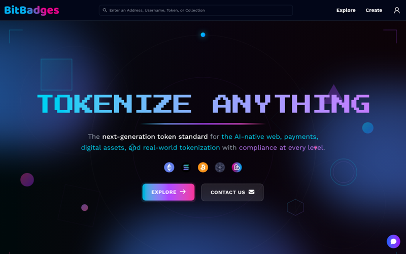

# Using the Frontend

The site at [bitbadges.io](https://bitbadges.io) is where you browse collections, review and sign transactions, claim tokens, and manage what you own. Building is developer-first: describe a token to your own AI or the `bb` CLI, then bring the result to the site to review and sign. This section walks a new user through each screen with real screenshots.

## What the Site Does

- Browse and search collections, accounts, and activity.
- Read a collection: its tokens, owners, transferability, and permissions.
- Connect a wallet and sign in, so the site can show your account and let you sign.
- Review a transaction that a tool built for you, then sign it in your wallet.
- Fill in a template form (subscription, NFT, vault, and more) when you prefer a form to a CLI.
- Manage API keys, claims, plugins, and OAuth apps in the Developer Portal.
- Claim tokens through a claim link.

## The Pages

| Page | Read it when you want to |
| --- | --- |
| [Connect a Wallet](connect-a-wallet.md) | Sign in, understand what a session is, and read the two address formats |
| [Browse and Search](browse-and-search.md) | Find a collection, an account, or a token from the home page |
| [Collection Page](collection-page.md) | Read the tabs on one collection, including transferability and permissions |
| [Create Tab and In-Site Forms](create-tab-and-in-site-forms.md) | Pick a template form, or take the programmatic path |
| [Review and Sign](review-and-sign.md) | Land from `bb preview` or paste a transaction, review it, and sign |
| [Developer Portal](developer-portal.md) | Create API keys and manage claims, plugins, and OAuth apps |
| [Account and Balances](account-and-balances.md) | See the tokens you own, your approvals, and your activity |
| [Claims and Distribution](claims-and-distribution.md) | Claim a token from a claim link and read the criteria it checks |

## Layout

Every page shares the same header:

1. The search bar accepts an address, username, token, or collection.
2. Explore opens the browse page. Create opens the template picker.
3. The account icon opens the wallet picker. After sign-in it shows your avatar.

The site follows your system theme and has a light and dark mode; the screenshots in this section switch with the docs theme. They were captured at 1440 by 900 against bitbadges.io, so the collections, accounts, and counts on screen are real. The home page keeps its dark hero in both themes.

## Related

- [Quickstart](../start/quickstart.md)
- [Guides](../guides/README.md)
- [Agents](../agents/README.md)
