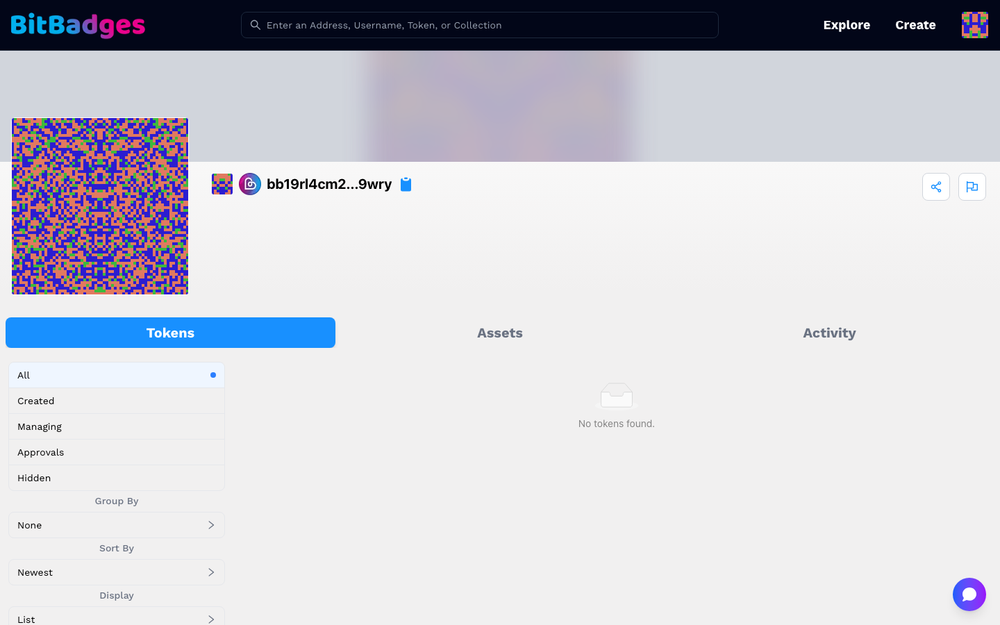
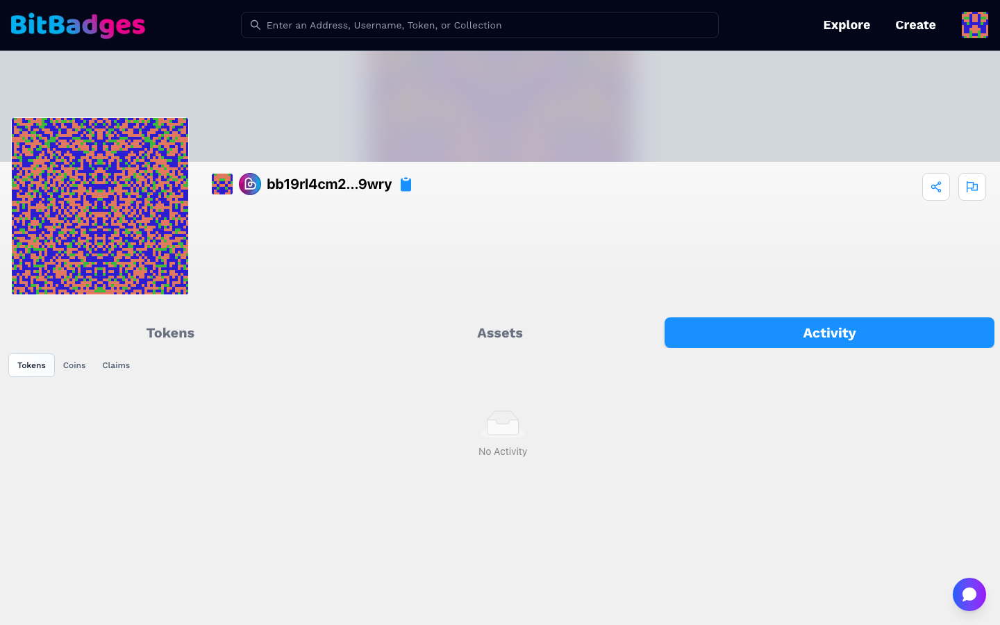

# Account and Balances

An account page is `bitbadges.io/account/<address or username>`. Anyone can open it. When it is your own address and you are signed in, an Assets tab and the account settings appear too.

## 1. Open Your Account

Click your avatar in the header after signing in, or search your address. The banner shows the avatar, the username or address, the chain icon, and a copy button. Share and report icons sit at the right.

## 2. Tokens

The Tokens tab is the balance view. The left column filters it:

| Filter | Shows |
| --- | --- |
| All | Every collection where the address holds a balance |
| Created | Collections the address created |
| Managing | Collections where the address is the manager |
| Approvals | Collections where the address has set an incoming or outgoing approval |
| Hidden | Collections you hid from the All view (your own account only) |

Under the filters, Group By, Sort By, and Display change the layout. Each row is one collection with the token name and the amount held.

Each row opens the collection page. The balance shown is the current one; time-based balances change on their own as the ownership times pass, which is why a card can disappear without a transfer. See [Balances](../token-standard/concepts/balances.md).

## 3. Approvals You Granted

The Approvals filter lists collections where this address has user-level approvals. An outgoing approval lets someone move tokens out of this address under its criteria. An incoming approval controls what can arrive. Open the collection, then the Distribution tab and User Approvals, to read or change them. Changing one is a transaction signed in your wallet.

## 4. Assets and Activity

Assets appears on your own account and lists coin balances such as BADGE and IBC denoms.

Activity is the history, split into three sub-tabs:

- Tokens: transfers in and out, with the sender, the recipient, the collection, and the time. Mint appears as the sender for minted tokens.
- Coins: bank sends.
- Claims: claim attempts and their results.

## 5. Settings

Your own account has a settings page at `/account/<address>/settings` for the profile (username, avatar, bio, links) and a codes page at `/account/<address>/codes` for the QR codes that Sign In with BitBadges providers issue to you.

## What You Can Do Here

- See every token an address holds and open its collection.
- Filter to what you created, manage, or approved.
- Read transfer, coin, and claim history.
- Hide collections from your own All view.
- Edit your profile and read your sign-in QR codes.

## Related

- [Balances](../token-standard/concepts/balances.md)
- [Collection Page](collection-page.md)
- [Set Transferability](../guides/set-transferability.md)
