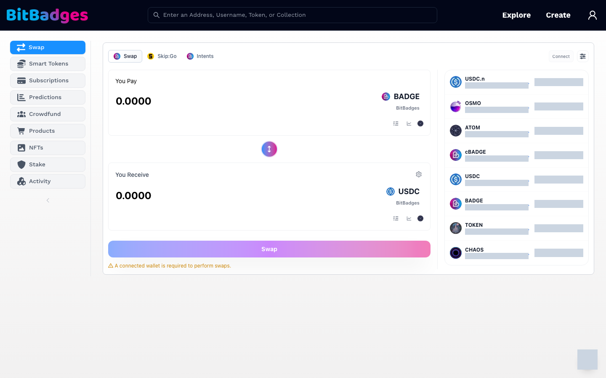
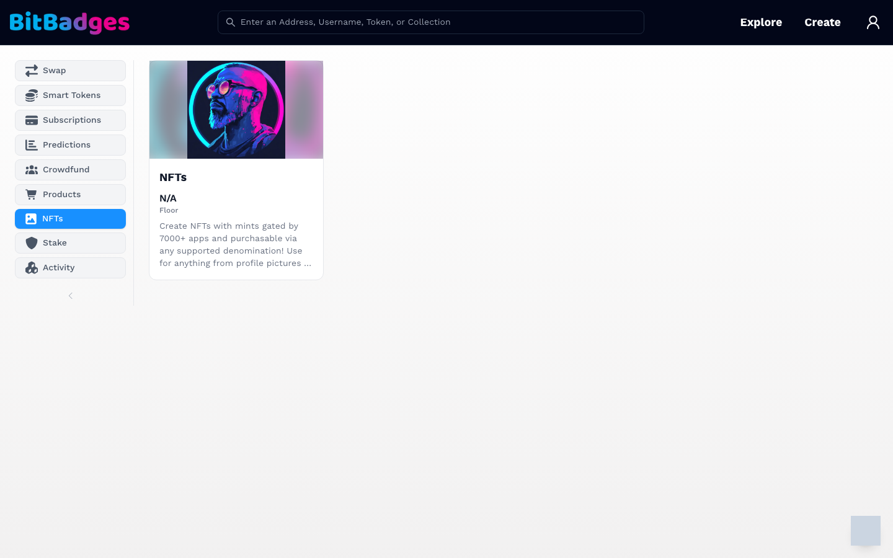
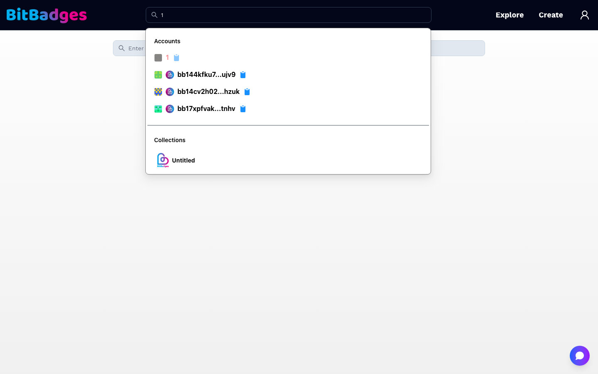

# Browse and Search

Three entry points get you to a collection or account: the home page, the browse page under Explore, and the search bar in the header.

## 1. Start From the Home Page

The home page has the search bar in the header and an Explore button in the hero. Both are public; no wallet is needed.

## 2. Explore

Click Explore, or go to [bitbadges.io/browse](https://bitbadges.io/browse). The left sidebar switches between categories:

| Category | Shows |
| --- | --- |
| Swap | The swap panel, with Skip:Go and Intents as alternate routes, and the asset list with live prices |
| Smart Tokens | Collections backed by USDC, ATOM, or another ICS20 asset |
| Subscriptions | Collections that charge on a schedule |
| Predictions | Prediction markets |
| Crowdfund | Crowdfunding campaigns |
| Products | Storefront collections |
| NFTs | Non-fungible collections |
| Stake | Staking for the BADGE coin |
| Activity | Recent transfers across the chain |

Each category is a grid of cards with the collection image, name, floor price, and description. Click a card to open its collection page. The URL carries the category as `?tab=`, so a link to a category can be shared.

## 3. Search

Type into the header search bar, or go to [bitbadges.io/search](https://bitbadges.io/search) for the full-width version. Results group by type as you type:

- Accounts match an address in either format, a username, or a numeric account ID.
- Collections match a name or a collection ID.
- Tokens match a token inside a collection.

Click a result to open it. Each account row has a copy button for the address.

## Collection Page Anatomy

A collection page has a banner, the collection image, the name and description, and a row of tabs. The tabs are Tokens, Distribution, Details, and Actions. Linked Items appears when the manager attached related content, and a Claim tab appears first when you arrive from a claim link. [Collection Page](collection-page.md) walks through each one.

## What You Can Do Here

- Open any collection or account without a wallet.
- Filter the browse page by category and share the category link.
- Search by address, username, account ID, collection ID, or name.
- Copy an address from a search result.

## Related

- [Collection Page](collection-page.md)
- [Trade on the DEX](../guides/trade-on-the-dex.md)
- [BADGE Token](../about/badge-token.md)
