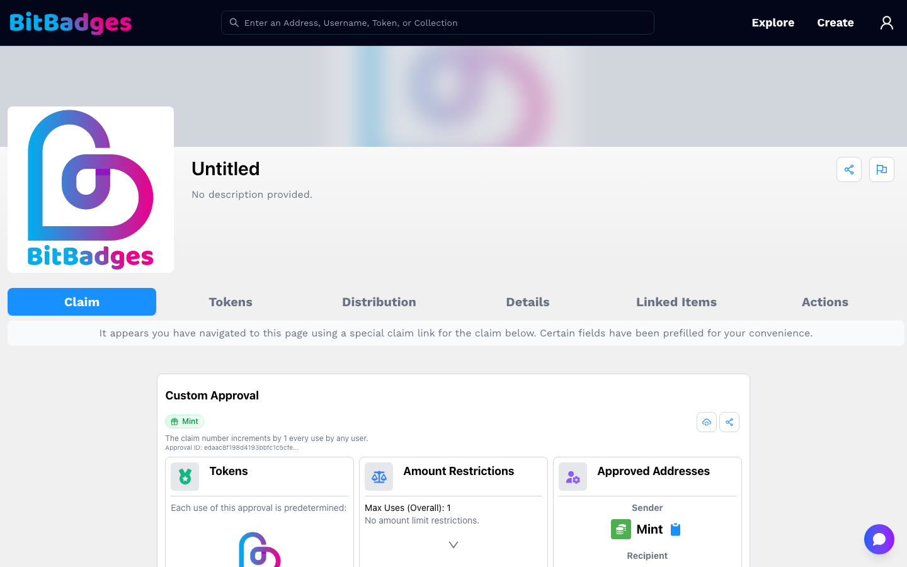
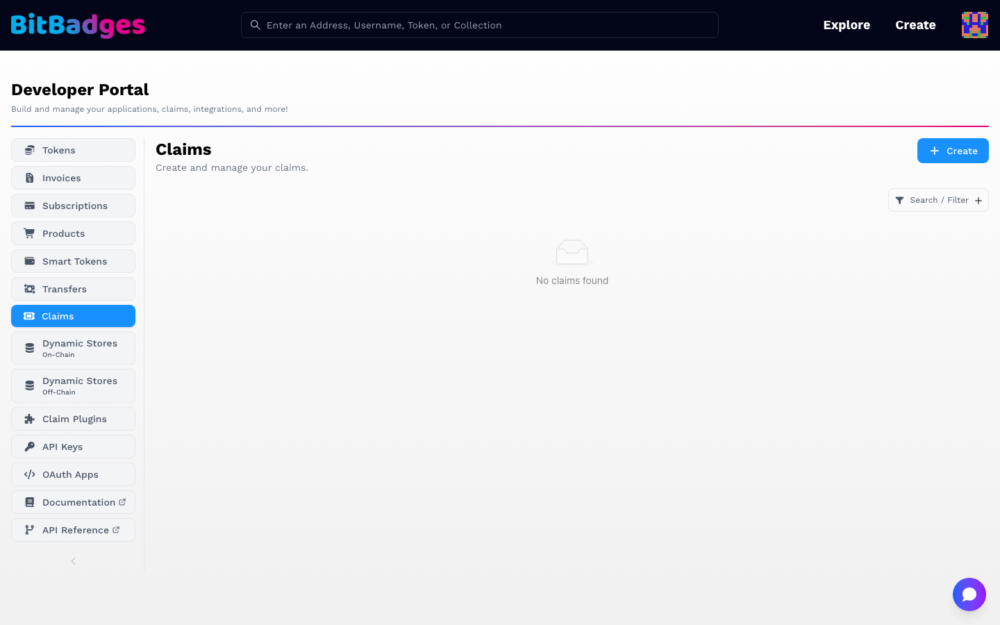

# Claims and Distribution

A claim is the usual way tokens reach people: the creator sets the criteria, shares a link, and each user who meets the criteria claims for themselves. On the site a claim is a tab on the collection page.

## 1. Open a Claim Link

A claim link is a collection URL with the claim in the query: `bitbadges.io/collections/<collectionId>?claimId=...&approvalId=...`. Links from a code or password campaign carry those in the query too.

The page opens on a Claim tab that only exists for this link. A banner confirms that the link prefilled the claim.

## 2. Read the Card

The card is the approval that mints the token. Its three columns are the criteria:

| Column | Answers |
| --- | --- |
| Tokens | Which token IDs and amounts each claim gives. A predetermined claim gives a fixed set per use. |
| Amount Restrictions | How many uses in total, per address, and any amount caps |
| Approved Addresses | Who can send (Mint) and who can receive |

Below the columns, the claim's plugins are listed: a code, a password, an allowlist, a social account, or a custom plugin. Each one is a check you must pass. Expand a row for details.

## 3. Claim

1. Connect and sign in with the address that should receive the token.
2. Complete each plugin row that needs input, such as a code or a social sign-in.
3. Click Claim. Your wallet asks for a signature on the transfer.

The token appears on your account page once the transaction is in a block. The Claims sub-tab under Activity keeps the attempt history.

## 4. Manage Your Own Claims

Your claims live in the Developer Portal under Claims. Create opens the claim builder: pick plugins, set the number of uses, and attach the claim to a collection approval or run it standalone. The row for each claim shows uses and links to the attempts. The plugin catalog and the API behind it are on [Plugins](../api/claims/plugins.md).

## What You Can Do Here

- Claim a token from a link, a code, or a password.
- See which criteria you pass before you sign.
- Track your attempts under Activity.
- Build and manage claims as a creator.

## Related

- [Distribute with Claims](../guides/distribute-with-claims.md)
- [Build a Claim Plugin](../guides/build-a-claim-plugin.md)
- [Claims](../api/claims/README.md)
