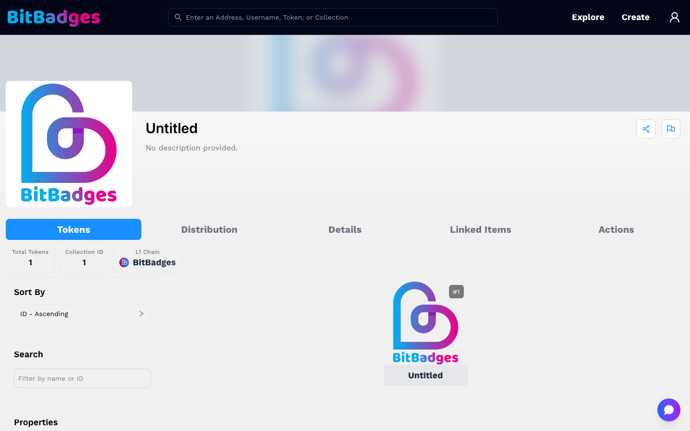
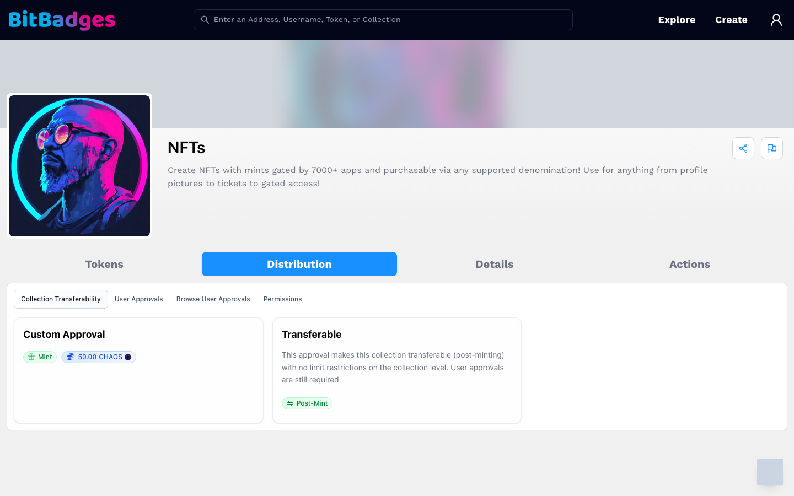
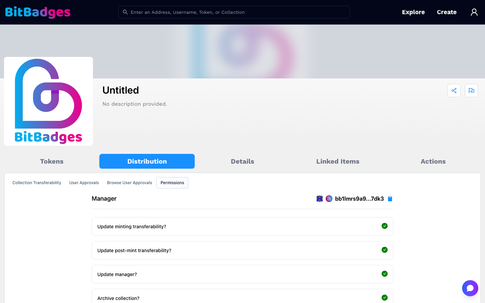
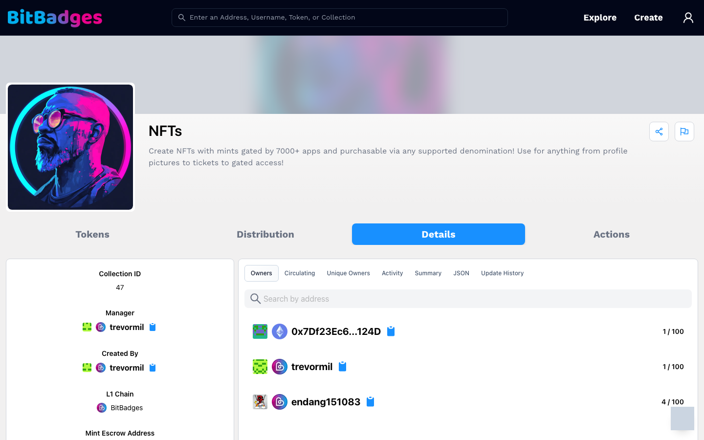

# Collection Page

A collection page shows everything the chain and the BitBadges API know about one collection. The URL is `bitbadges.io/collections/<collectionId>`.

## 1. Tokens

The default tab. The stat row shows Total Tokens, Collection ID, and L1 Chain; a tradable collection adds Lowest Price, Overall Volume, and Weekly Volume. The left column sorts and filters by name, ID, price range, and properties. Each card is one token with its listing status; click it to open the token page at `/collections/<collectionId>/<tokenId>`.

## 2. Distribution

This tab answers "who can move tokens, and under which rules". It has four sub-tabs.

| Sub-tab | Shows |
| --- | --- |
| Collection Transferability | The collection-level approvals. Each card is one approval, tagged with its sender (for example Mint or Post-Mint), its price when it charges one, and its claim count when it has a claim. |
| User Approvals | Your own incoming and outgoing approvals for this collection, once signed in. |
| Browse User Approvals | Any address's approvals, by address. |
| Permissions | What the manager can still change. |

How to read a transferability card:

1. The first tag names the sender list. Mint means new tokens come from the mint address; Post-Mint means transfers between holders.
2. A price tag shows what each use costs. A claim tag shows uses so far against the maximum.
3. Click the card to expand the approval criteria: which tokens, which amounts, which addresses, and which times.

An approval authorizes a transfer when someone submits a matching transaction. If it overrides the sender's outgoing approvals, an authorized initiator can move a holder's tokens without that holder signing. Read the initiator list and overrides together. The full rules are in [Transferability](../token-standard/concepts/transferability.md).

## 3. Permissions

The Permissions sub-tab names the manager, then lists each manager permission as a question with a status icon.

- A green check means the manager can still perform that action.
- A red cross means the action is locked.

Rows include updating minting transferability, updating post-mint transferability, updating the manager, archiving the collection, and updating metadata. Locked permissions are how a collection commits to its rules. See [Permissions](../token-standard/concepts/permissions.md).

## 4. Details

The left column lists Collection ID, Manager, Created By, L1 Chain, and Mint Escrow Address. The right column has sub-tabs:

- Owners: every address with a balance and how much of the supply it holds, searchable.
- Circulating and Unique Owners: supply stats.
- Activity: transfers in this collection.
- Summary and JSON: the collection as the chain stores it.
- Update History: every transaction that changed the collection.

## 5. Linked Items and Actions

Linked Items appears only when the manager attached related claims, listings, or pages. Actions shows what your address can do: transfer, set an approval, or, as the manager, update the collection. Templates with their own flow, such as auctions and storefronts, hide this tab.

## What You Can Do Here

- Open a single token, an owner, or the manager's account.
- Read every approval and the criteria behind it.
- Check which manager permissions are locked.
- Copy the collection JSON.
- Share the page or report it with the icons at the top right.

## Related

- [Transferability](../token-standard/concepts/transferability.md)
- [Permissions](../token-standard/concepts/permissions.md)
- [Balances](../token-standard/concepts/balances.md)
