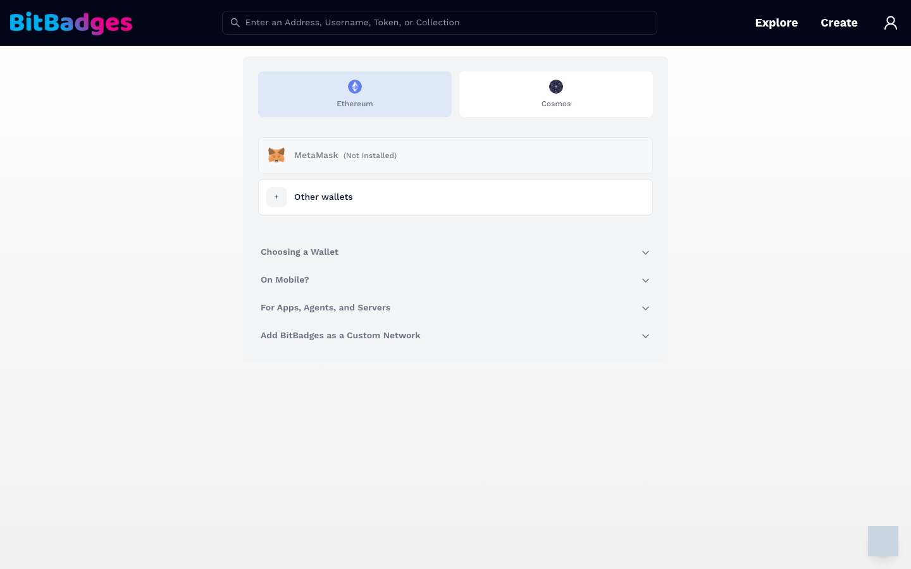
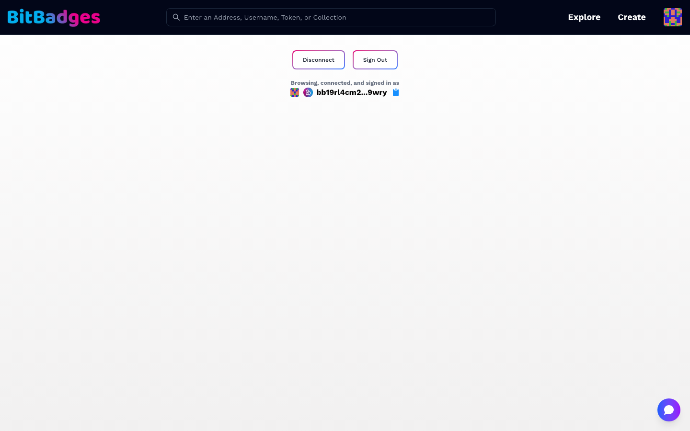

# Connect a Wallet

Connecting a wallet lets the site show your account. Signing in proves you hold the key, so the site can act for you against the BitBadges API.

## 1. Open the Wallet Picker

Click the account icon at the top right, or go to [bitbadges.io/connect](https://bitbadges.io/connect). The picker has two tabs:

- Ethereum: MetaMask and, under Other wallets, any injected EVM wallet.
- Cosmos: Keplr, Leap, and other Cosmos wallets.

The expanders under the list cover the common questions: how to choose a wallet, what to do on mobile, how apps and agents connect, and how to add BitBadges as a custom network in your wallet.

## 2. Connect

Pick a wallet. The wallet extension asks you to approve the connection. After approval, the header shows your avatar in place of the account icon. At this point you are connected but not signed in.

## 3. Sign In

Click Sign In. The wallet asks you to sign a short message. This signature is never broadcast; it only proves you hold the key. The site stores a session cookie so you stay signed in across pages.

Two buttons are then available:

- Sign Out ends the session but keeps the wallet connected.
- Disconnect drops the wallet connection.

## What a Session Is

A session is a signed-in state on the BitBadges API, tied to one address. Signed-in pages (the Developer Portal, template forms, your own account settings) need it. Public pages (browse, collection pages, other accounts) do not.

Signing a transaction is separate. Every transaction still goes to your wallet for its own signature, whether or not you are signed in.

## Address Formats

A given 20-byte account address can be represented in either format. This is an encoding conversion; importing the same mnemonic into Cosmos and EVM wallets can derive different accounts. Always fund the address shown by the wallet you will sign with:

| Format | Example | Used by |
| --- | --- | --- |
| `bb1...` | `bb19rl4cm2...9wry` | The BitBadges chain and Cosmos wallets |
| `0x...` | `0x1234...abcd` | Ethereum wallets and EVM tools |

The site shows the native form for the wallet you connected and an icon for the chain. Searching by either form finds the same account. The conversion rules are in [Accounts and Addresses](../token-standard/concepts/accounts.md).

## What You Can Do Here

- Connect an Ethereum or Cosmos wallet.
- Sign in to reach gated pages.
- Copy your address in the form your wallet uses.
- Sign out or disconnect.

## Related

- [Accounts and Addresses](../token-standard/concepts/accounts.md)
- [Sign In Users](../guides/sign-in-users.md)
