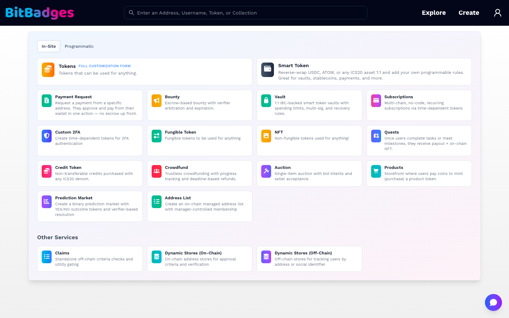
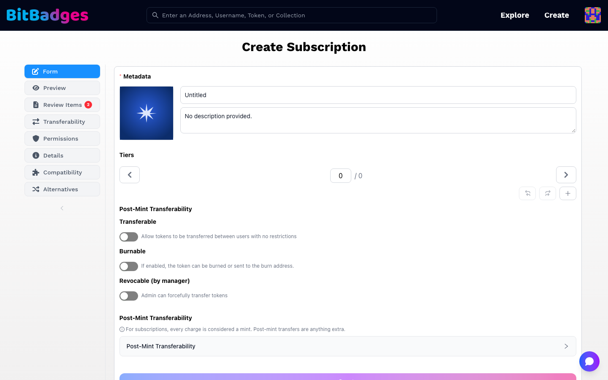
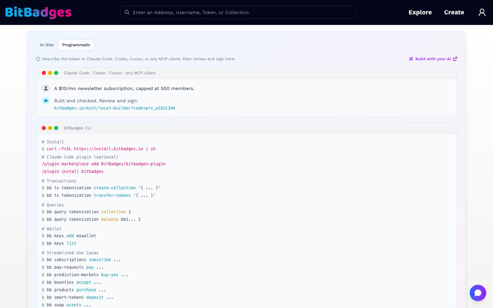

# Create Tab and In-Site Forms

The Create tab is the fork between two ways to build: a template form on the site, or a transaction built by your own AI or the `bb` CLI. The URL is [bitbadges.io/create](https://bitbadges.io/create).

## 1. Choose In-Site or Programmatic

The two tabs at the top of the card:

- In-Site: a grid of template forms. Each card is one product shape with sensible defaults.
- Programmatic: instructions for building with Claude Code, Codex, Cursor, any MCP client, or the CLI, then reviewing and signing on the site.

Both paths end at the same review step and the same wallet signature.

## 2. Pick a Template

The In-Site grid, as of this writing:

| Card | Builds |
| --- | --- |
| Tokens | The full customization form, for any collection shape |
| Smart Token | A 1:1 reverse-wrap of USDC, ATOM, or another ICS20 asset with your own rules |
| Payment Request | A one-action pay request to a specific address |
| Bounty | An escrowed bounty with a verifier and an expiration |
| Vault | An IBC-backed vault with spending limits and recovery rules |
| Subscriptions | Recurring, time-dependent tokens |
| Custom 2FA | Time-dependent tokens for two-factor checks |
| Fungible Token, NFT | The two basic collection shapes |
| Quests | Payout plus an NFT when users complete tasks |
| Credit Token | Non-transferable credits bought with any ICS20 denom |
| Crowdfund, Auction, Products, Prediction Market | Campaign, single-item sale, storefront, and binary market |
| Address List | An on-chain list with manager-controlled membership |

Other Services covers things that are not collections: Claims, Dynamic Stores (On-Chain), and Dynamic Stores (Off-Chain).

Every template form is a signed-in page. The site asks you to connect and sign in first.

## 3. Fill In the Form

Each template opens at `bitbadges.io/mint/<template>`, for example `/mint/subscriptions`.

The left sidebar is the step list. Form is where you type; the rest are read-only views of what the form produces.

| Step | What it does |
| --- | --- |
| Form | Metadata (image, name, description), the template's own fields (tiers for a subscription), and the post-mint switches: Transferable, Burnable, Revocable by manager |
| Preview | The collection page as it will look after creation |
| Review Items | Flags the form raised, such as a missing image or an open permission. The badge count is the number still open |
| Transferability | The approvals the form generated |
| Permissions | The manager permissions the form will lock or leave open |
| Details, Compatibility, Alternatives | Summary, wallet and chain compatibility, and other templates that fit the same need |

Move between steps freely; the form keeps its state. The Create button at the bottom of the form opens the wallet for the signature.

## 4. Take the Programmatic Path Instead

The Programmatic tab shows the loop in two panels:

1. Describe the token to your AI. The tool builds and checks it, then prints a link of the form `bitbadges.io/mint/local-builder?code=prv_...`.
2. Open the link, or paste the JSON on [Review and Sign](review-and-sign.md).

The lower panel is a `bb` CLI cheat sheet: install, the Claude Code plugin, transactions, queries, wallet commands, and the streamlined use-case commands. The Build with your AI link opens the setup page for each harness.

## What You Can Do Here

- Start a template form for the common product shapes.
- Create a standalone claim or a dynamic store.
- Switch to the programmatic path and read the CLI cheat sheet.
- Return to a form later; the Developer Portal lists what you created.

## Related

- [Review and Sign](review-and-sign.md)
- [Create a Collection](../guides/create-a-collection.md)
- [Subscriptions and Time-Based Tokens](../guides/subscriptions-and-time-based-tokens.md)
- [Agents](../agents/README.md)
