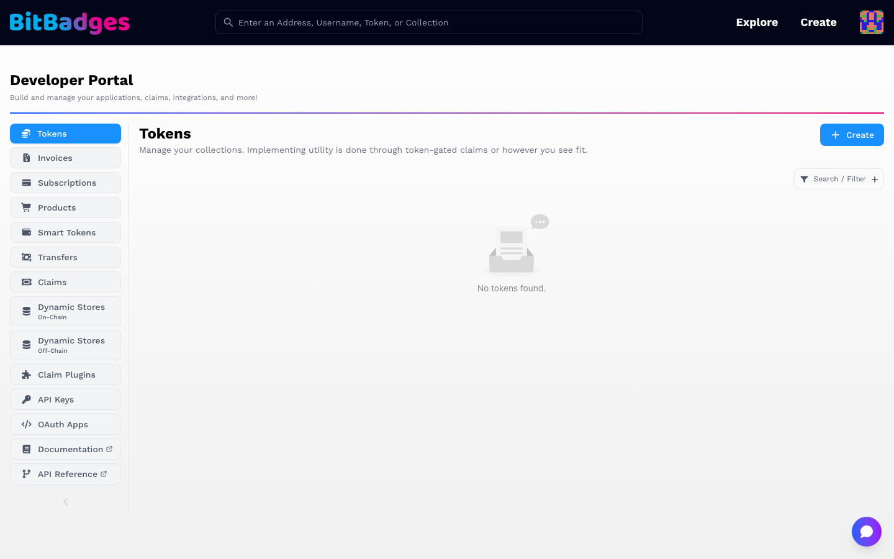
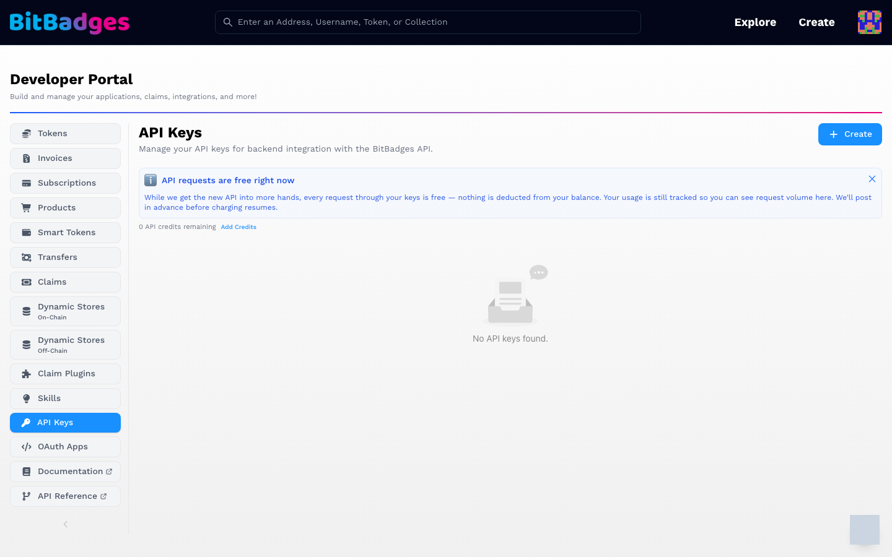

# Developer Portal

The Developer Portal at [bitbadges.io/developer](https://bitbadges.io/developer) is the signed-in home for everything you manage: collections you created, claims, plugins, API keys, and OAuth apps.

## 1. Find Your Way Around

The left sidebar is the section list. Each section has a Create button at the top right and a Search / Filter control.

| Section | Holds |
| --- | --- |
| Tokens | Collections your address created or manages |
| Invoices, Subscriptions, Products, Smart Tokens, Transfers | The product-shaped views of those collections |
| Claims | Standalone claims and their attempts |
| Dynamic Stores (On-Chain, Off-Chain) | Address stores that approval criteria and plugins read |
| Claim Plugins | Custom plugins you published, with their secrets |
| Skills | Prompt plugins for the hosted AI builder |
| API Keys | Keys for the BitBadges API |
| OAuth Apps | Apps that use Sign In with BitBadges |
| Documentation, API Reference | External links to these docs |

A link of the form `/developer?tab=apiKeys` opens a section directly once the portal has loaded.

## 2. Create an API Key

1. Open API Keys.
2. Click Create. Give the key a label.
3. Copy the key once. The list shows only a prefix afterwards.
4. Send it as the `x-api-key` header, or set it in `bb` so the CLI and the MCP tools can call the API.

The notice at the top states the current billing rule. As of this writing, requests through your keys are free and usage is still counted. The credit balance and Add Credits link sit under the notice. Limits and pricing are on [BitBadges API](../api/README.md).

## 3. Claims and Plugins at a Glance

The Claims section lists every claim you own. Each claim is a set of plugins; each plugin is one criterion, such as a code, a password, an allowlist, or a social account. Create opens the claim builder, where you add plugins and set the number of uses.

Claim Plugins is where a custom plugin lives once you publish one. Each row shows the plugin secret, masked, with a copy button. The secret is what your webhook checks to confirm a call came from BitBadges. Rotate it from the same row.

Dynamic Stores are the address sets those plugins and on-chain approval criteria can read.

## What You Can Do Here

- See and update the collections you created or manage.
- Create, copy, and revoke API keys.
- Build claims and read their attempt history.
- Publish a custom plugin and manage its secret.
- Register an OAuth app for Sign In with BitBadges.

## Related

- [BitBadges API](../api/README.md)
- [Claims](../api/claims/README.md)
- [Plugins](../api/claims/plugins.md)
- [Sign In with BitBadges](../api/sign-in/README.md)
