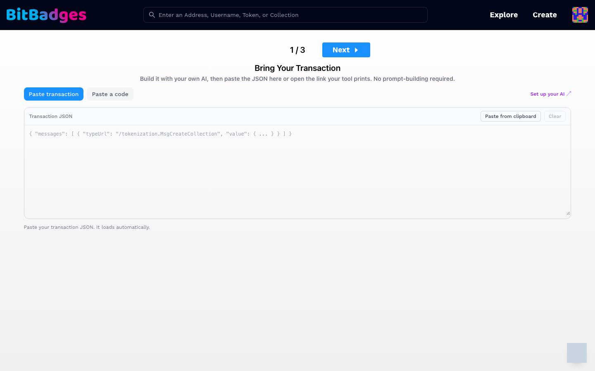

# Review and Sign

The page at `bitbadges.io/mint/local-builder` turns a transaction built elsewhere into a signed one. It is where `bb preview --open` and MCP `get_review_url` links land. Sign in first; the page needs a session.

## 1. Bring Your Transaction

The page opens on step 1 of 3. Three ways to load a transaction:

| Way | How |
| --- | --- |
| Open a link | `bb preview --open` prints `/mint/local-builder?code=prv_...`. The page loads the transaction and lands on Review directly. A link with `#tx=` carries the JSON itself. |
| Paste a code | Switch to the Paste a code tab and type the `prv_` code. Codes expire one hour after creation. |
| Paste transaction | Paste the transaction JSON into the Transaction JSON box, or click Paste from clipboard. It loads as soon as the JSON parses. |

One accepted JSON shape is: `{ "messages": [ { "typeUrl": "/tokenization.MsgCreateCollection", "value": { ... } } ] }`. Set up your AI at the right links to the harness setup page.

## 2. Review

Step 2 is disabled until a transaction is loaded. It shows the same sidebar as an in-site form:

- Preview: the collection page as it will look on chain.
- Review Items: flags to clear, such as an open permission or a missing metadata field. Each item explains itself and links to the fix.
- Transferability: every approval in the transaction, as cards.
- Permissions: the manager permissions as a question list.

Extra steps appear when the transaction needs them: Claim Secrets when a claim has codes or a password, Fund Mint Address when a mint escrow needs coins, and Auto Transfers when the transaction moves tokens right after creation.

Nothing on this page edits the transaction. If a review item needs a change, fix it in your tool and load the result again.

## 3. Sign

The last step hands the transaction to your wallet. Approve the signature there. The site broadcasts it and shows the result.

## What You Can Do Here

- Load a transaction from a link, a code, or pasted JSON.
- See the preview, review items, transferability, and permissions before anything is signed.
- Sign and broadcast from the wallet you connected.

## Related

- [Analyze Commands](../cli/analyze.md)
- [Agents](../agents/README.md)
- [Set Up Your AI](../agents/setup.md)
